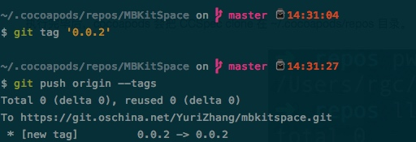
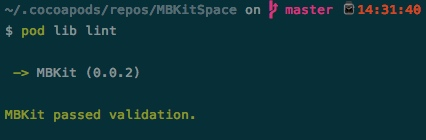
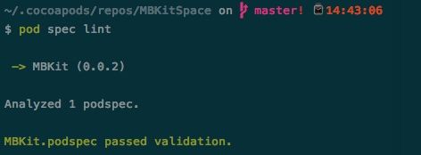
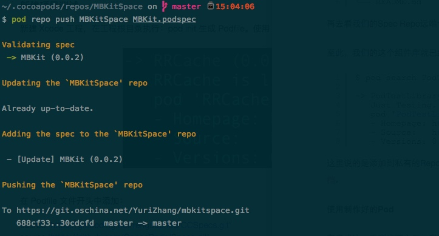
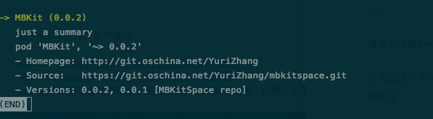

# Cocoapods私有Pod仓库
本文主要介绍的内容是如何使用Cocoapods搭建私有Spec仓库, 涉及私有Pod提交以及私有Pod版本更新。平常开发中常用的使用场景就是大家口中经常提到的“组件化开发”。

**私有Pod创建步骤：**
1. 依赖git托管平台管理私有Spec仓库；
2. 创建Pod的所需要的项目工程文件；
3. 创建私有的Spec仓库管理podspec文件；
4. 创建私有podspec文件并编辑相关内容；
5. 验证podspec文件的有效性；
6. 提交podspec文件至私有spec仓库；
7. 测试使用已提交的私有pod；
8. 私有pod版本更新

###依赖远程或本地git托管平台
私有Spec仓库需要依托于git托管平台，本文使用的是[码云（OSChina提供托管平台）](https://git.oschina.net/)进行演示。
在码云上新建新的项目 [MBKitSpace](https://git.oschina.net/YuriZhang/mbkitspace)。  
创建完成之后在Terminal中执行如下命令:  

```  
# pod repo add [Private Repo Name] [GitHub HTTPS clone URL]  
pod repo add MBKitSpace https://git.oschina.net/YuriZhang/mbkitspace.git
```  

如果成功的话进入到 ~/.cocoapods/repos 目录下就可以看到 MBKitSpace 这个目录了。至此第一步创建私有Spec Repo完成了。
###创建私有的项目工程文件
第二步，如果有现有的项目，并且还在git下进行管理的可以忽略这一步。如果没有，那就新建一个或者拖入一个希望进行管理的组件。
在功能稳定后在当前分支打tag，并push到远程仓库

  

###创建私有Pod的podspec
首先，进入到工程的根目录下，即 `~/.cocoapods/repos/MBKitSpace`。
执行 `pod spec create 工程名`, 创建成功后会在工程的根目录下创建 MBKitSpace.podspec 文件。
**常用podspec文件的设置：**   

```
Pod::Spec.new do |s|
# 私有pod名称
s.name         = "MBKit"
# 当前版本号
s.version      = "0.0.2"
# 项目描述
s.summary      = " just a summary"
# 项目简介
s.description  = <<-DESC
               just a description
              DESC
# 仓库首页地址
s.homepage     = "http://git.oschina.net/YuriZhang"
# license
s.license      = { :type => "MIT", :file => "LICENSE" }
# 作者信息
s.author       = { "Author" => "Email" }
# 平台
s.platform     = :ios
# 平台版本
s.platform     = :ios, "8.0"
# 仓库源
s.source       = { :git => "https://git.oschina.net/YuriZhang/mbkitspace.git", :tag => "#{s.version}" }
# 代码源文件地址，**/*表示Classes目录及其子
s.source_files  = "MBKitTest", "MBKitTest/**/*.{h,m}"
s.exclude_files = "Classes/Exclude"
```  

如何添加资源文件

1.添加xib

在pod中,xib不能当成源文件(即s.source_files),否则pod install之后会报错"Unable to run command 'StripNIB xxx.nib' - this target might include its own product".所以必须要将xib放入资源文件中(即s.resources)

使用此方式后,虽然可以在不改变原xib任何代码的情况下直接使用,但是需要将xib中使用到的图片文件拷贝到当前项目的Assets.xcassets中

2.添加图片

方式1:类似于xib,不需其它操作,将用到图片添加到当前项目Assets.xcassets中;

方式2:将图片放入s.Resource(或者s.resource_bundles)中 

### 验证podspec文件有效性
1. 执行 `pod lib lint` 输出如下结果即为通过：


2. 执行 `pod spec lint` 输出如下结果即为通过：



如果以上两步全部通过，就证明podspec文件配置成功。
###提交podspec至私有仓库
在podspec所出文件目录执行 `pod repo push MBKitSpace MBKit.podspec` 执行完成之后这个组件库就添加到我们的私有Spec Repo中了，可以进入到~/.cocoapods/repos/MBKitSpace目录下查看，就可以看到提交的对应版本信息了。



至此，我们的这个组件库就已经制作添加完成了。  

###使用私有仓库  

1. 执行 `pod search MBKit` 查询私有仓库
     
2. 创建Podfile文件，在 Podfile 文件开头中添加：

    ```
    source 'https://git.oschina.net/YuriZhang/mbkitspace.git'
    source 'https://github.com/CocoaPods/Specs.git'
    ``` 
    如果不添加官方库地址，若私有库的类库的子依赖，依赖了公有库某个类库，会导致pod install失败。 
    
###更新私有仓库
首先，更新的场景肯定是在原有项目的基础上进行了业务的扩展或者原有功能的改进。
具体的操作步骤如下：
1. 首先修改podspec文件中的s.version；
2. 新功能增加或原有功能改进，打tag并push到远程仓库；
3. 验证podspec文件的有效性
4. 推送podspec至远程仓库

##常用的pod指令
1. 显示本地repo列表 `pod repo list`
2. 删除本地repo `pod repo remove <REPO_NAME>`
3. 更新某个repo `pod repo update <REPO_NAME>`


###坑！大坑！
1. 提交成功后搜索不到结果

```
[!] Unable to find a pod with name, author, summary, or description matching `Trangram`
```
解决办法： 
执行 `rm ~/Library/Caches/CocoaPods/search_index.json `
成功后重新搜索。   
2. `pod lib lint `报错  

```
ERROR | [iOS] file patterns: The `source_files` pattern did not match any file.
```
解决办法：重新打开xxx.podspec文件编辑一下，确定共享文件路径没有错误，然后再上传到github上验证。
3. `pod lib lint `报错 

``` 
WARN  | description: The description is equal to the summary.
```
解决办法： 重新打开xxx.podspec文件编辑一下，确定s.summary内容与s.description不相同

更多坑请移步这里[查看](http://blog.csdn.net/daiyelang/article/details/68488760)。


